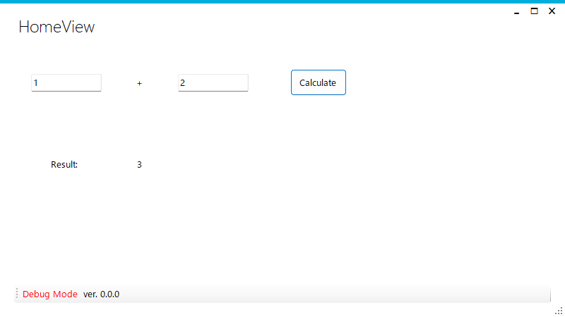

# WinForm Metro MVVM C# Boilerplate



## ディレクトリ構成

```txt
+ apps/
|  |
|  + WinFormBoilerplate/
|     + WinFormBoilerplate.Domain/
|     + WinFormBoilerplate.Infrastructure/
|     + WinFormBoilerplate.WinForm/
|     + WinFormBoilerplateTest.Tests/
|     + WinFormBoilerplate.sln              : Visual Studio ソリューションファイル 
|
+ docs/
|  |
|  + dev-notes/                             : 開発の実装手順メモなど
|  + git-rule.md                            : gitルール
|  + todo.md                                : タスクメモ
|
```
